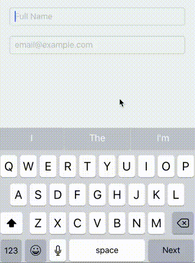
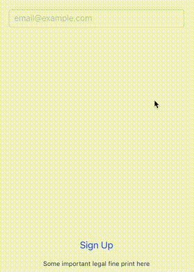
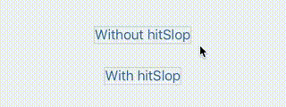

在移动应用开发之中，有大量琐碎而微妙的细节需要注意，而开发人员往往会忽视掉这些东西，本文将介绍这些问题，并示例如何在React Native中处理这些问题。

> 我们将持续改进并增加更多关于“提升用户体验”的信息。 如果你想帮忙，请访问 [react-native/14979](https://github.com/facebook/react-native/issues/14979)。

## 要点索引

* [配置文本输入](#配置文本输入)
* [虚拟键盘弹出时的布局管理](#虚拟键盘弹出时的布局管理)
* [点击区域自动放大](#make-tappable-areas-larger)
* [使用 Android Ripple(点击操作的图形反馈)](#use-android-ripple)
* [更多](#learn-more)

---

## 配置文本输入

在触控手机上输入文字是一种挑战 - 小屏幕，虚拟键盘。 但是根据用户需要输入的数据类型，我们可以通过配置文本输入设置来简化它：

* 输入框自动获取焦点
* 使用输入提示（placeholder）来展示正确的输入数据示例
* 启用或关闭自动补全和自动纠错
* 选择合适的键盘类型 (比如 邮件, 数字)
* Make sure the return button focuses the next field or submits the form

查看 [`TextInput`文档](textinput.md)以获取更多的配置选项

[在您的移动设备上进行尝试](https://snack.expo.io/H1iGt2vSW)

## 虚拟键盘弹出时的布局管理

软件(虚拟)键盘几乎占据了屏幕的一半。 如果您的交互式元素会被键盘覆盖，请确保它们仍可通过使用[`KeyboardAvoidingView`ss组件](keyboardavoidingview.md)访问。

[在您的移动设备上进行尝试](https://snack.expo.io/ryxRkwnrW)

## 合理的扩大可点击区域

在手机上很难精确的按准按钮。 一方面可以确保所有互动元素大小至少有 `44x44`。 另一种则是为元素留出足够的空间:`padding`，`minWidth`和`minHeight`样式。 或者，您可以使用[`hitSlop` prop](touchablewithoutfeedback.md#hitslop) 来增加交互区域而不影响布局。 请看下面的演示：

[在您的移动设备上进行尝试](https://snack.expo.io/rJPwCt4HZ)

## 使用安卓波纹效果（Android Ripple）

Android API 21使用 **material设计风格**的波纹效果在用户触摸屏幕上的可互动区域时向用户提供视觉反馈。 React Native通过[`TouchableNativeFeedback` 组件](touchablenativefeedback.md)调用。 使用这种可触摸的效果会比不透明度或高亮显示更加合适。 也就是说，使用它时需要小心，因为它不适用于iOS或Android API <21，所以您需要在跨平台时准备其他方案以适配ios。当然您可以使用像[react-native-platform-touchable](https://github.com/react-community/react-native-platform-touchable)这样的库来处理您的平台差异。

[在您的移动设备上进行尝试](https://snack.expo.io/SJywqe3rZ)

## 显示横竖屏锁定

除非布局兼容支持横竖屏，否则最好的做法应是将屏幕方向锁定为纵向或横向。 在iOS上，在 `Xcode` 的常规选项卡和部署信息部分中，启用要支持的设备方向（确保您在进行更改时从设备菜单中选择了iPhone）。 对于`Android` ，打开`AndroidManifest.xml`文件并在 **activity** 元素中添加 `android：screenOrientation ='portrait'`来锁定为纵向或`android：screenOrientation ='landscape'`来锁定横向。

# Learn more

[Material Design](https://material.io/) 和 [Human Interface Guidelines](https://developer.apple.com/ios/human-interface-guidelines/overview/design-principles/) 是了解更多关于移动平台设计的优秀资源。